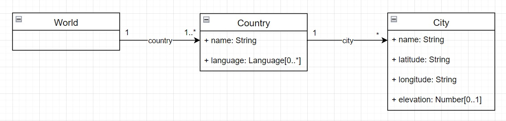
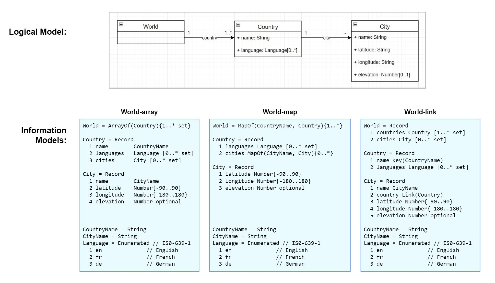
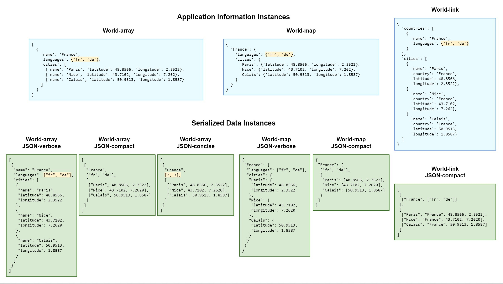

# Logical, Information and Data Models

Logical models describe physical or logical real-world entities, while an information model
is a syntax-independent definition of the physical data used to implement a logical model.
An information model facilitates translation from a logical model to physical data by
defining when two data values represent the same information and thus can be losslessly converted
from one data format to another.
Translating a logical model to an information model involves several kinds of design decisions,
whereas translating an information model to a data model is the algorithmic process of applying serialization rules.
The rules aren't specific to any problem domain, and once defined they can be applied to any information model.

Consider a trivial logical model describing a world consisting of countries and cities:

There are several ways to define information that represents even this simple model, for example
  1. Arrays with name and value items
  2. Maps with key and value properties
  3. Arrays or Maps with references between types

As a logical model gets more complex, for example by defining generalization / specialization relationships,
the number of ways to represent it as information increases.
Information has a small set of datatype building blocks, and designing an information model
means making design choices for which building block to use to represent each characteristic
of the logical model.

Three information models representing the World logical model are:

For each information model there are many ways of serializing an information instance into data. Only JSON examples are shown, but the same instance can be serialized to and from XML, RDF, JSON-LD, etc.  For each data type there are three verbosity levels:
1. The "verbose" method typically used in JSON-centric design - every property is serialized with a name and value
2. The "compact" method used with databases - results in "friendly" JSON data without unnecessary repeated key names
3. The "concise" method, which is compact and also replaces strings with indexes, typically used for vocabularies and localization where a message number gets translated to equivalent strings in different languages

There are a few points to note:
* The information value looks JSON-ish but it is not JSON, it is a programming language value.  The "languages" property is a Python set that has no JSON equivalent. The difference between information and data would be more obvious when serializing XML to/from the identical Python value.
* logical models define validity but not equality.  For the languages property, validity lists the legal values, but equality determines whether two different values are equal.  In a list, ["fr", "de"] is not equal to ["de", "fr"], but in a set {"fr", "de"} equals {"de", "fr"}.  The logical model shows multiplicity but doesn't specify whether multiple values are ordered or unordered. The information model specifies whether order is significant, enabling equality testing to work correctly.

## Demo
The [World](World) directory contains the three information models, along with verbose JSON, compact JSON, and concise JSON
data files for each model. The [check-cities](check-cities.py) script loads and validates each IM, decodes/validates
each of the data files against the IM, then prints the information instance decoded from each file.
Although the data formats are different, the information contained in each file is identical,
indicating that information can be translated from one data format to any other without loss.

Install the JADN information modeling package prior to running the check-cities script with:`pip install jadn`